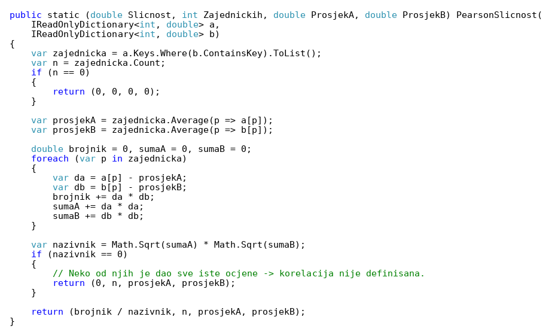
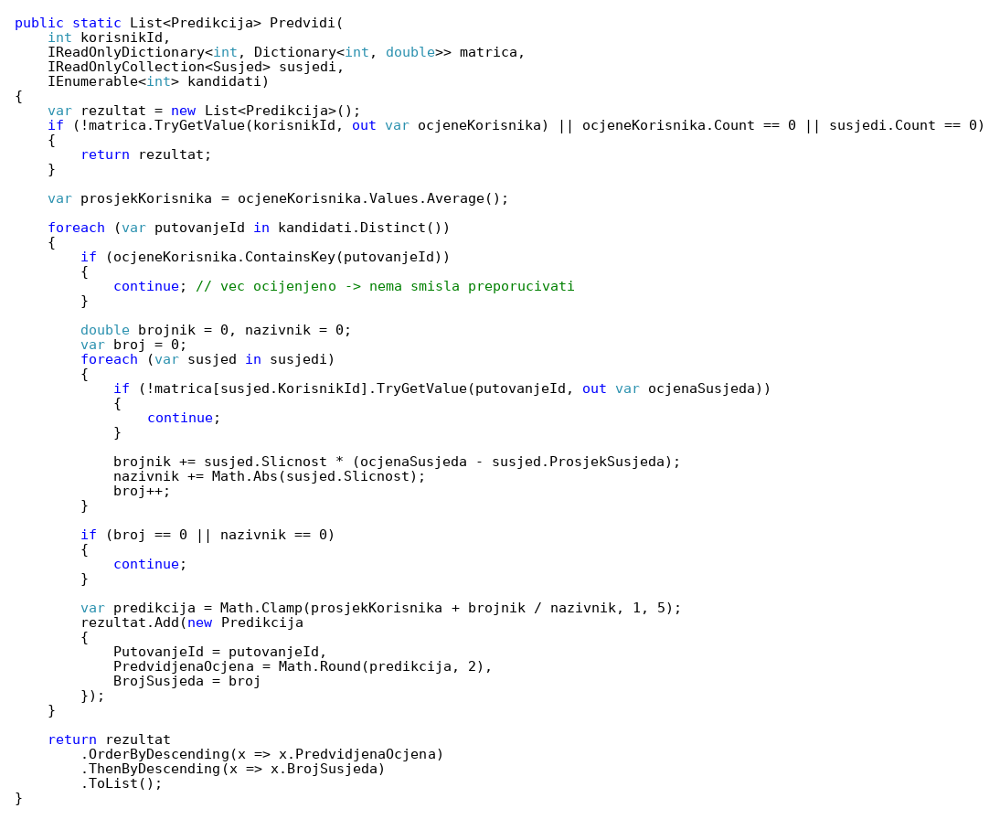

# 1. Opis

Aplikacija preporučuje putovanja klijentima pomoću **user-based collaborative filtering** algoritma (filtriranje zasnovano na korisnicima), kako je opisano u prijavi teme. Pretpostavka je da će se korisnici koji su se u prošlosti slagali u ocjenama putovanja vjerovatno slagati i u budućnosti.

Ulazni podaci su ocjene putovanja (tabela `Ocjene`, vrijednosti 1–5). Jedan korisnik može ocijeniti jedno putovanje samo jednom (jedinstveni indeks `KorisnikId + PutovanjeId`; ponovno ocjenjivanje ažurira postojeću ocjenu).

# 2. Algoritam

**Korak 1 – sličnost korisnika (Pearsonova korelacija).** Za ciljnog korisnika *a* i svakog drugog korisnika *b* posmatraju se samo putovanja koja su **oba ocijenila** (skup *P*):

    sim(a,b) = Σp (o(a,p) − ō(a)) · (o(b,p) − ō(b))  /  ( √Σp (o(a,p) − ō(a))² · √Σp (o(b,p) − ō(b))² )

gdje su ō(a) i ō(b) prosjeci ocjena nad tim zajedničkim putovanjima. Ako je nazivnik 0 (korisnik je dao sve iste ocjene), sličnost je 0.

**Korak 2 – K najbližih susjeda (KNN).** Zadržavaju se korisnici sa pozitivnom sličnošću i najmanje 2 zajednički ocijenjena putovanja (da jedna slučajna zajednička ocjena ne da sličnost 1.0). Sortiraju se po sličnosti i uzima se K najsličnijih (K = 5).

**Korak 3 – predviđanje ocjene.** Za svako buduće putovanje koje korisnik nije ocijenio niti rezervisao:

    pred(a,p) = ō(a) + Σn sim(a,n) · (o(n,p) − ō(n))  /  Σn |sim(a,n)|

preko susjeda *n* koji su ocijenili *p*. Rezultat se ograničava na interval 1–5, a putovanja se sortiraju po predviđenoj ocjeni (preporučuju se ona sa predviđenom ocjenom ≥ 3).

**Korak 4 – hladni start.** Ako korisnik još nema ocjena ili nema dovoljno sličnih korisnika, lista se dopunjava najbolje ocijenjenim budućim putovanjima (izvor „Popularno").

## Provjera na primjeru sa predavanja

Primjer iz predavanja P9 / Excel fajla *Sistemi_Preporuke_Primjer 2.xlsx* (ocjene za BMW, Audi, VW, Mercedes, Hyundai):

| Korisnik | Sličnost sa Zaninom | Zajedničkih ocjena |
|---|---|---|
| Jasmin | 0,853 | 4 |
| Goran | 0,707 | 4 |
| Adel | 0,000 | 4 |
| Denis | −0,792 | 4 |

Uz K = 2 (Jasmin, Goran): pred(Zanin, Hyundai) = 4 + (0,853·(3−2,25) + 0,707·(5−3,5)) / (0,853+0,707) = 5,09 → **5**.
Vrijednosti su identične formulama iz Excel primjera (kolone *Sličnost* i *Predikcija N=2*). Na slajdu je za Jasmina navedeno 0,634, ali ista formula u Excel primjeru daje 0,853.

# 3. Parametri

Parametri nisu hardkodirani – nalaze se u konfiguraciji (`appsettings.json`, u Dockeru `.env`):

| Parametar | Vrijednost | Značenje |
|---|---|---|
| `Preporuke__BrojSusjeda` | 5 | K u KNN |
| `Preporuke__MinZajednickihOcjena` | 2 | minimalan broj zajednički ocijenjenih putovanja |
| `Preporuke__MinSlicnost` | 0 | uzimaju se samo susjedi sa većom sličnošću |
| `Preporuke__BrojPreporuka` | 5 | broj preporučenih putovanja |

# 4. Putanje do izvornog koda

- Algoritam (bez baze, lako testiranje): `TuristickaAgencija.Services/RecommenderService/UserBasedCollaborativeFiltering.cs`
- Servis (učitavanje ocjena, kandidati, hladni start): `TuristickaAgencija.Services/RecommenderService/RecommenderService.cs`
- API: `TuristickaAgencija.WebAPI/Controllers/RecommenderController.cs`
  - `GET api/Recommender/Moje` – preporuke za prijavljenog korisnika (mobilna aplikacija)
  - `GET api/Recommender/GetRecommendedPutovanja/{putovanjeId}` – preporuke na detaljima putovanja (mobilna aplikacija)
  - `GET api/Recommender/Korisnik/{korisnikId}` – detaljan rezultat sa susjedima (desktop, samo Admin)
- Desktop prikaz: `UI/turisticka_agencija_admin/lib/screens/preporuke_screen.dart`

## Glavna logika – Pearsonova sličnost

{ width=95% }

## Glavna logika – predviđanje ocjene

{ width=95% }

# 5. Prikaz u aplikaciji

**Desktop aplikacija → Preporuke → odabrati klijenta „Amila Turković (mobile)".** Prikazuju se najsličniji klijenti (Pearsonova sličnost i broj zajedničkih ocjena) i preporučena putovanja sa predviđenom ocjenom.

Sa testnim podacima korisnik *mobile* voli ljetovanja (Budva 5, Dubrovnik 5) a slabije ocjenjuje gradske ture (Beograd 2, Minhen 2, Beč 2). Algoritam pronalazi klijente sličnog ukusa i preporučuje:

| Putovanje | Predviđena ocjena | Broj susjeda koji su ga ocijenili |
|---|---|---|
| Split i Hvar | 4,51 | 4 |
| Madrid i Toledo | 4,46 | 1 |
| Atina i Akropolj | 4,46 | 1 |
| Barcelona i Costa Brava | 4,42 | 4 |
| Santorini – grčka bajka | 4,33 | 3 |

*(Ovdje dodati screenshot ekrana „Preporuke" iz desktop aplikacije i ekrana sa preporukama iz mobilne aplikacije.)*
